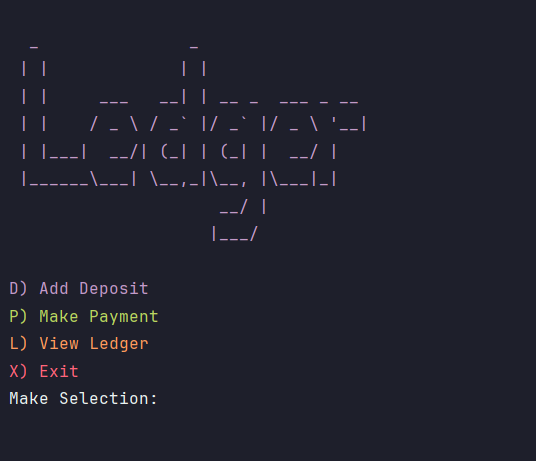

# Accounting Ledger Application

A command-line financial tracking application designed to help users record deposits, log payments, and view transaction history. 
The application features a comprehensive reporting system to filter transactions by date ranges and vendor names, with all records persistently stored in a local CSV file.

---

## Features

### Main Navigation (Home Screen)
The application runs continuously until the user explicitly chooses to exit, offering the following primary actions:
Add Deposit (D):** Prompts the user for deposit details and saves the record.

- Make Payment (P): Prompts the user for debit/payment details and saves the record. 
- Ledger (L): Opens the Ledger interface to view transaction history. 
- Exit (X): Safely terminates the application.

### Ledger Viewer
The ledger automatically sorts all entries chronologically, displaying the newest entries first.
 All (A): Displays the complete transaction history.
 Deposits (D):  Filters the view to show only account deposits (positive entries).
 Payments (P): Filters the view to show only account payments/debits (negative entries).
 Reports (R): Opens the advanced reporting menu.
 Home (H): Returns to the main home screen.

### Advanced Reports
Pre-defined and custom filters for targeted financial analysis:
 (1) Month To Date: Transactions from the 1st of the current month to today.
 (2) Previous Month: Transactions from the first to the last day of the previous month.
 (3) Year To Date: Transactions from January 1st of the current year to today.
 (4) Previous Year: Transactions spanning the entirety of the previous calendar year.
 (5) Search by Vendor: A custom search that prompts for a vendor name and displays all matching entries.
 (0) Back: Returns the user to the main Ledger screen.

## Usage Instructions

1.  Compile and run the main application file via your terminal or IDE.
2.  Ensure a `data` directory exists in the project root containing the `transactions.csv` file (or allow the program to generate it upon the first entry).
3.  Navigate the menus by typing the corresponding letter or number indicated in the prompts and pressing `Enter`.
4.  When entering dates, ensure they follow the standard `YYYY-MM-DD` format.


## Project Structure

```text
src/
└── org/example/
    ├── LedgerApplication.java       # Main entry point
    ├── enums/
    │   └── PaymentType.java         # Transaction categories
    ├── models/
    │   ├── Ledger.java              # Logic for managing transactions
    │   ├── Transaction.java         # Data model for a single entry
    │   ├── TransactionSearch.java   # Search logic/filters
    │   └── TransactionsRepository.java # Data persistence/storage
    ├── utils/
    │   ├── MessageColor.java        # Terminal color constants
    │   └── UI.java                  # Reusable scanner/input helpers
    └── views/
        ├── HomeView.java            # Main menu screen
        ├── home/
        │   ├── DepositView.java     # Logic for for viewing deposits
        │   └── PaymentView.java     # Logic for viewing payments
        ├── ledger/
        │   ├── LegderView.java      # General ledger display
        │   └── TransactionsView.java # Specific transaction lists
        └── reports/
            ├── CustomSearchView.java
            ├── ReportsView.java
            └── SearchByVendorView.java
